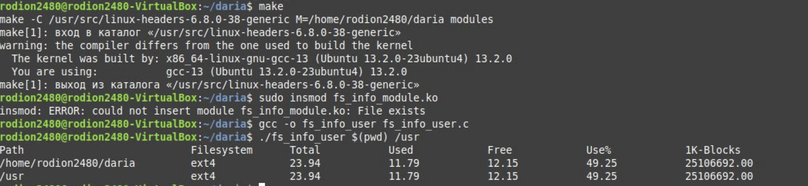
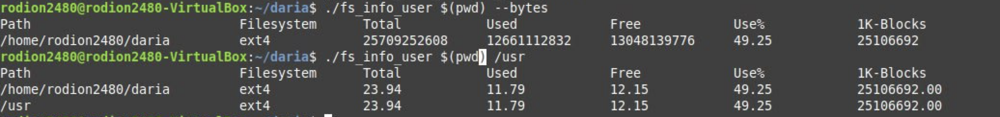
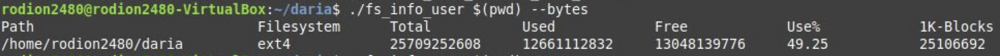

# Лабораторная работа №3

`Шевченко Дарья P3330`

`Вариант: ioctl: df`

## Задание

Разработать комплекс программ на пользовательском уровне и уровне ярда, который собирает информацию на стороне ядра и передает информацию на уровень пользователя, и выводит ее в удобном для чтения человеком виде. Программа на уровне пользователя получает на вход аргумент(ы) командной строки (не адрес!), позволяющие идентифицировать из системных таблиц необходимый путь до целевой структуры, осуществляет передачу на уровень ядра, получает информацию из данной структуры и распечатывает структуру в стандартный вывод. Загружаемый модуль ядра принимает запрос через указанный в задании интерфейс, определяет путь до целевой структуры по переданному запросу и возвращает результат на уровень пользователя

---

Реализация драйвера [fs_info_module](https://github.com/dariayo/operating-systems-3/blob/main/fs_info_module.c)

Реализация пользовательской программы [fs_info_user](https://github.com/dariayo/operating-systems-3/blob/main/fs_info_user.c)

## Краткий обзор кода

### fs_info_user

Получает информацию о файловой системе для указанных путей через устройство /dev/fs_info с использованием ioctl.

Статистика включает общий размер, использованное и свободное место, процент использования.

### fs_info_module

Реализует устройство /dev/fs_info, которое обрабатывает запросы от пользовательского пространства через ioctl.

## Запуск и работа программы

## Заключение

Драйвер ядра реализует виртуальное устройство, которое обрабатывает запросы на получение информации о файловой системе через системный вызов ioctl.
Программа, используя ioctl, запрашивает статистику файловой системы с устройства /dev/fs_info, что позволяет получить данные, аналогичные тем, которые выводит утилита df.
Также реализована гибкость вывода данных в различных форматах (в байтах или гигабайтах)
